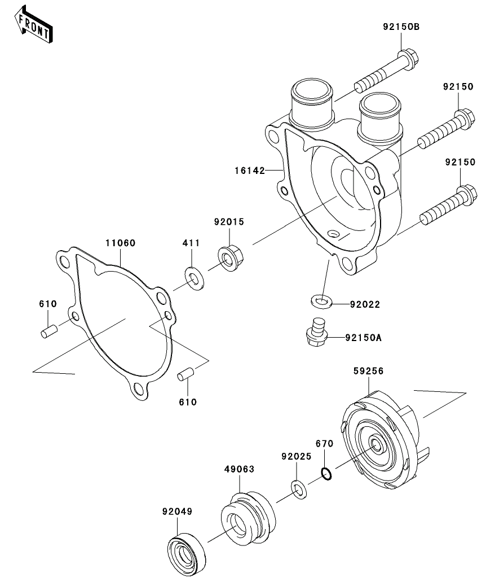

autoscale: true
build-lists: true
theme: Simple, 3

# It’s just JavaScript:<br>kicking the tires of React

## Cameron Gorrie

^ This is a casual introduction so kick your feet up

^ This talk is web dev focused so I'm going to be talking about ReactDOM renderer we'll learn about other renderers like React Native in the other talks!

---

^ 30 years of manufacturing, virtually unchanged

^ It's heavy, slow, burns oil like Kuwait in '91, poor bore quality control, a strange wiring harness, a faulty adjuster lever, awful brakes, weak subframe bolts... the list goes on

^ It truly isn't great at anything, except that it can do just about everything. -- Blackheart58


# This is a 2006 KLR650

---

^ The KLR is great because unlike expensive beautiful bikes you don't feel bad about tinkering with it

^ Motorcycles are complex machines to maintain, you can start with analogy or metaphor to describe the system holistically, and gradually learn the subsystems in more detail


> On any mechanical repair job ego comes in for rough treatment. You're always being fooled, you're always making mistakes, and a mechanic who has a big ego to defend is at a terrific disadvantage.
-- Robert M. Pirsig, Zen and the Art of Motorcycle Maintenance

---

^ For me analogies don't stick, they have limited use when learning a system

^ I find learning really difficult, my a-ha! moments are few and far between, and the whole thing is painful and arduous

^ Take the perspective of React as a programming runtime, look at some broad concepts, and use those to dig into some of the internals

^ I am going to be hypocritical (i.e. describing data as a tree structure)

Analogies can be useful for conceptualizing complexity

- Closures are like mailing a package
- Reducers are like making a coffee
- Generators are like running a restaurant

<!--
---

# A-HA! moments

^ Thinking in terms of an execution model, reading JavaScript as the engine would interpret it

^ 1: `createCounter` and `increment` are declared and created in the global execution context

^ 2: `createCounter` is called and it's return value is assigned to `increment`

^ 3: calling `createCounter` creates a local execution context

^ 4: counter variable is assigned and the `innerFunc` is created in that local execution context

^ 5: local execution context is deleted, control is returned to the calling context, `createCounter` returns the `innerFunc` function which has access to the variables that were in scope when it was called

^ 6: calling `increment` creates a local execution context, retrieves the count variable from it's closure, sets it's value to one, and returns it before local execution context is deleted

[.code-highlight: all]
[.code-highlight: 1, 10]
[.code-highlight: 10]
[.code-highlight: 2-3]
[.code-highlight: 4, 10]
[.code-highlight: 11]

```js
function createCounter() {
  let counter = 0;

  return function innerFunc() {
    counter = counter + 1;
    return counter;
  }
}

const increment = createCounter();
const plusOne = increment(); // 1
const plusTwo = increment(); // 2
```

---

# Why React?
^ We need to understand the DOM, and the historical challenges web developers have faced

-->

---

# Intro to the DOM

[.build-lists: false]

^ Note: while AST is not equivalent to the DOM representation it's illustrative

The DOM is an in memory abstraction of structured text.

- Provides an interface for traversing and modifying nodes
- Nodes have their own properties and may also contain child nodes

```js
document.createElement("div");

{
  "name": "div",
  "children": [],
}
```

---

^ And this has caused all sorts of problems

# The DOM has historically been used to store state

---

# Shopify Admin and the DOM

^ Turbograft for server side partial page replacements and Twine for direct DOM manipulation

^ No way for components to coordinate how they read and write from the DOM

^ Lots of JavaScript written in HTML attributes (difficult to test, stored in global context)

- Lots of DOM interactions to be reflected immediately in the UI
- Frequent data changing over time
- User interactions that affect many other components in the UI

[.footer: [UI architecture problems](https://docs.google.com/document/d/1Z2lYsfX3oxytG4QNGaW6X83Z52Zz-jsrUFXp1zRGVpA)]

---

^ Having state in our programs is never simple. Anytime we want to dynamically change the content of the page we modify the DOM. To keep application state in both our program and the DOM adds complexity

Best practices for dealing with DOM state:

- Have a default application state that matches the default DOM conditions
- Interactions that mutate state should be applied to the DOM immediately from a single piece of code in the application
- Observe state in the application and not in the DOM
- Centralize application state (observers, state machines)
- Preserve state uniformly; i.e. a single save operation that updates the default DOM conditions

---

# Intro to the Virtual DOM

^ React's killer feature was the virtual DOM because it makes coding UI so much easier

^ Instead of telling the browser to go from the previous version of our app to the next version, we tell React what we want our next state to look like and have it figure it out for us, it's declarative inversion of control

^ We should think of it as more of a pattern than a specific technology

^ Think of the Virtual DOM as a tree of React elements that represent the user interface but also be aware that React has it's own internal objects called fibers that hold additional information about the component tree

The Virtual DOM is an abstraction of the HTML DOM with the following characteristics:

- Detached from the browser-specific implementation details
- Allows us to build apps without thinking about state transitions

[.footer: [Attribute differences between DOM & VDOM in React](https://reactjs.org/docs/dom-elements.html#differences-in-attributes)]

---

^ A `ReactElement` is a light, immutable, virtual representation of a DOM Element

^ Stateless objects are easy to compare and update, and are meant to be thrown away when we want to render something different later

In React the Virtual DOM nodes are `ReactElement`s, plain JavaScript objects that function as atomic building blocks

[.code-highlight: all]
[.code-highlight: 2]

```js
{
  type: 'button', // string type denotes a DOM node (props correspond to attributes)
  props: {
    className: 'primary',
    children: 'Click me',
  }
}
```

---

^ Components take one argument — an object hash containing props

^ Components are pure in respect to their props; local mutation is fine

`ReactComponent`'s are small, reusable pieces of code that return `ReactElement`'s

[.code-highlight: all]
[.code-highlight: 2, 5]

```js
function Card({showTitle, children}) {
  let title = null;

  if (showTitle) {
    title = <h1>Hello world</h1>;
  }

  return (
    <div>
      {title}
      {children}
    </div>
  );
}
```

---

# Constructing the Virtual DOM

^ When React encounters a function type, it inspects that component to determine what `ReactElement` it renders, given the corresponding props

^ React repeats this process until it has a representation of the underlying DOM tag elements for every component on the page

Components encapsulate element trees:

[.code-highlight: all]
[.code-highlight: 2]
[.code-highlight: 6-13]

```js
{
  type: PolarisButton, // Function type denotes a ReactComponent: evaluate the returned ReactElement
  props: {color: 'primary', children: 'Click me'}
}

// Resultant element tree
{
  type: 'button',
  props: {
    className: 'button button-primary',
    children: {type: 'span', props: { children: 'Click me' }}
  }
}
```

[.footer: [Components, instances, and elements oh my!](https://reactjs.org/blog/2015/12/18/react-components-elements-and-instances.html)]

---

# A brief foray into JSX

^ JSX is syntatic sugar that once compiled becomes a regular JavaScript function call that evaluates to a JavaScript object

```html
<Card title="Hello world">
  <button className="primary">Click me</button>
</Card>
```

```js
// compiles to
React.createElement(Card, {
  title: "Hello world"
},
React.createElement("button", {
  className: "primary"
}, "Click me"));
```

[.footer: [Try it out using the Babel REPL](https://babeljs.io/repl)]

---

# Renderer entry point

^ We've established that React programs construct a virtual DOM tree that may change over time

^ Using React DOM we want to transform our real DOM to match our virtual one

```html
<div id="app"></div>
```

```js
ReactDOM.render(
  <PolarisButton color="primary" />,
  document.getElementById('app')
);
```

```js
// ReactDOM renderer is effectively doing this
let domNode = document.createElement('button');
domNode.className = 'button-primary';

domContainer.appendChild(domNode);
```

---

# How do we make changes in our application?

^ Recap what we've learned:

^ When a component receives props as an input, it is because a particular parent component returned an element with its type and props

^ Props flow one way in React: from parents to children

^ A component cannot change its props, but it can change its state

^ Examples:

^ (props) i.e. fetching from network and passing data as props to child component

^ (state) i.e. checkbox is checked

---

^ State and/or prop changes in our component will return a different tree of React elements

^ We want to compare the current element tree state to our desired state

^ A simplified version of React could blow away the existing tree and re-create it from scratch but this would be slow and we'd lose DOM state (focus, selection)

> The process of figuring out what to do to the host instance tree in response to new information is sometimes called reconciliation.
-- Dan Abramov

---

^ Efficiency one: the instance stays the same when the component updates (state is maintained across renders)

^ Efficiency two: For DOM nodes we only need to update the changed attributes

# Reconciler Efficiencies

[.code-highlight: all]
[.code-highlight: 1, 2, 5, 6]
[.code-highlight: 9-11]
[.code-highlight: 13,14]

```js
// doesn't destroy this instance when props change
function PolarisButton({color}) {
  const className = `button button-${color}`;

  // doesn't destroy this DOM node when attributes change
  return <button className={className}>Click me</button>;
}

let domNode = document.createElement('button');
domNode.className = 'button button-primary';
domContainer.appendChild(domNode);

domNode.className = 'button button-secondary';
domContainer.appendChild(domNode);
```

---

^ Efficiency three: recursing on children

^ (Unshift) Updating the order of component children will cause React to mutate every child

^ Keys help React identify which items have been changed, added, or removed

# Reconciler Efficiencies cont'd

[.code-highlight: all]
[.code-highlight: 4]

```js
function Card({title, buttons}) {
  const eachButton = buttons.map(({id, content, color}) => {
    return (
      <PolarisButton key={id} color={color}>
        {content}
      </PolarisButton>
    );
  });

  ...
}
```

---

^ So now we understand a little bit about JSX, the Virtual DOM concept of constructing ReactElement trees, keys, and reconciliation let's take apart a subsystem of React like we would our KLR650

^ Water pump anecdote

^ 1. `executeDispatch`



# Where the Reconciler meets the Renderer

---

# The end... well kind of

[.build-lists: false]

- [Inversion of control: letting React call our functions](https://overreacted.io/react-as-a-ui-runtime/#inversion-of-control)
- [Batching state updates](https://overreacted.io/react-as-a-ui-runtime/#batching)
- [Fiber: the render phase work loop and the commit phase](https://medium.com/react-in-depth/inside-fiber-in-depth-overview-of-the-new-reconciliation-algorithm-in-react-e1c04700ef6e)
